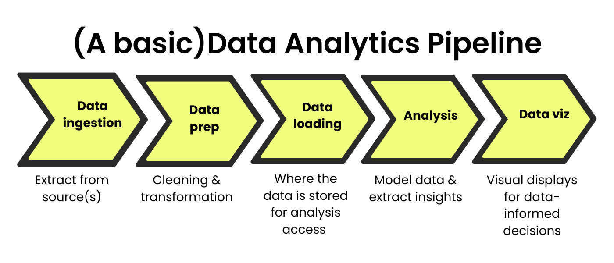

<h1 align="left"> Data to Dashboard </h1>
Resources to help the everyday analyst get data, clean &amp; prep the data, store it, &amp; visualize it. 

<h1> Why does this resource exist? </h1>
I built this resource because not everyone is a "data" person in that they aren't a data engineer, didn't study data, or do a lot of the back-end work to make the data usable.  So many of us just need to get the number or the chart to make a decision, take an action, build a report; to just do our jobs. 

As the workforce changes, we are now expected to not just get the number or create the chart, we're expected to prepare the data (clean & transform it!) and then do our regular work. But if you're not a data person, how do you do that other stuff? ChatGPT is helpful though as of this writing, it doesn't get it right on the first time. 

**My goal is to provide these resources in a way that a lot of people can understand so that they can do their work efficiently and effectively.** 

Before we dive into resources, let's get an understanding of a basic data and analytics pipeline (the process of getting data to when it gets to the reporting or dashboard stage). 

<h1> The Data Pipeline </h1>
To understand how to gain skills across the pipeline, we need to have a shared understanding of what makes up the data pipeline.  For the purposes of these materials, the data pipeline looks like the following:

